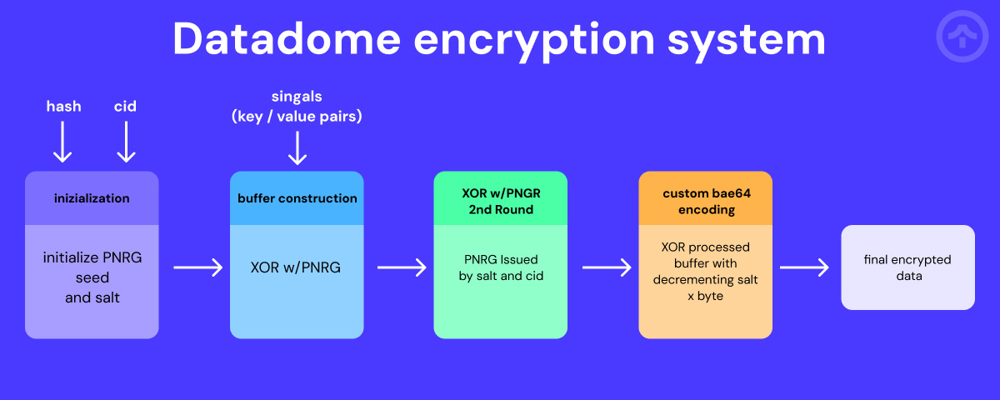

# DataDome Encryption System: Reverse Engineering & Implementation

**A comprehensive reverse engineering analysis of DataDome's client-side encryption algorithm used in their anti-bot protection system alongside a npm module**

<div align="center">
  
  
  
  <a href="https://www.npmjs.com/package/datadome-encryption"></a>
  <a href="https://github.com/aster-go/datadome-encryption"></a>
  <a href="https://github.com/aster-go/datadome-encryption"></a>
</div>

<br>

<div align="center">
<a href="https://github.com/aster-go/datadome-encryption-python"></a>
  <a href="https://medium.com/@aster-go/breaking-down-datadome-captcha-waf-d7b68cef3e21"></a>
  </div>
<br>


## Documentation

This repository contains a complete analysis of DataDome's encryption system:

| Document | Description |
|----------|-------------|
| [README.md](README.md) | Project overview and introduction |
| [ENCRYPTION.md](./docs/ENCRYPTION.md) | Detailed analysis of the encryption algorithm |
| [DECRYPTION.md](./docs/DECRYPTION.md) | Implementation of the decryption process |
| [technical_analysis.md](./docs/technical_analysis.md) | Technical deep-dive into cryptographic properties |
| [LEARN.md](./docs/LEARN.md) | Educational guide on reverse engineering techniques |

## Table of Contents
- [DataDome Encryption System: Reverse Engineering \& Implementation](#datadome-encryption-system-reverse-engineering--implementation)
  - [Documentation](#documentation)
  - [Table of Contents](#table-of-contents)
  - [Installation \& Quick Start](#installation--quick-start)
    - [Basic Usage Example](#basic-usage-example)
  - [Project Overview](#project-overview)
  - [Reverse Engineering Process](#reverse-engineering-process)
    - [Step 1: Original Code Extraction](#step-1-original-code-extraction)
    - [Step 2: Core Function Identification](#step-2-core-function-identification)
    - [Step 3: Algorithmic Analysis](#step-3-algorithmic-analysis)
    - [Step 4: Rewriting as a Clean Implementation](#step-4-rewriting-as-a-clean-implementation)
  - [Decryption Implementation](#decryption-implementation)
  - [Usage Examples](#usage-examples)
    - [Encryption](#encryption)
    - [Different Challenge Types](#different-challenge-types)
      - [Technical differences between challenge types:](#technical-differences-between-challenge-types)
    - [Decryption](#decryption)
  - [Technical Deep Dive](#technical-deep-dive)
  - [Project Files](#project-files)
  - [Learn from this Project](#learn-from-this-project)
  - [Conclusion](#conclusion)
    - [Critical Evaluation of DataDome's Encryption](#critical-evaluation-of-datadomes-encryption)
  - [Author](#author)
  - [Contributing](#contributing)

---

**Need DataDome Bypass Solutions?**

If you need a reliable DataDome bypass solution for your project, turn to the experts who truly understand the technology. My company, TakionAPI, offers professional anti-bot bypass APIs with proven effectiveness against DataDome and other bot-defense systems.

No more worrying about understanding, reversing, and solving the challenge yourself, or about keeping it up to date every day. One simple API call does it all.

We provide free trials, example implementations, and setup assistance to make the entire process easy and smooth.  
- 📄 [Check our straightforward documentation](https://docs.takionapi.tech)  
- 🚀 [Start your trial](https://dashboard.takionapi.tech)  
- 💬 [Contact us on Discord](https://takionapi.tech/discord) for custom development and support.

**Visit [TakionAPI.tech](https://takionapi.tech) for real, high-quality anti-bot bypass solutions — we know what we're doing.**

---

## Installation & Quick Start

Install the module from npm:

```bash
npm install datadome-encryption
```

### Basic Usage Example

```js
const { DataDomeEncryptor, DataDomeDecryptor } = require('datadome-encryption');

const cid = "YOUR_CLIENT_ID";
const hash = "YOUR_HASH_STRING";
const signals = [
  ["key1", "value1"],
  ["key2", 123],
  // ... more key-value pairs
];

// Encryption
const encryptor = new DataDomeEncryptor(hash, cid);
signals.forEach(([key, value]) => encryptor.add(key, value));
const encrypted = encryptor.encrypt();
console.log('Encrypted:', encrypted);

// Decryption
const decryptor = new DataDomeDecryptor(hash, cid);
const decrypted = decryptor.decrypt(encrypted);
console.log('Decrypted:', decrypted);
```

Replace `YOUR_CLIENT_ID` and `YOUR_HASH_STRING` with your actual values. The `signals` array should contain your key-value pairs to encrypt.

check out [tests/validity_check.js](./tests/validity_check.js) for a better understanding.

## Project Overview



DataDome is a cybersecurity company valued at $33M specializing in bot detection and mitigation. This project decomposes their proprietary encryption mechanism, transforming the heavily obfuscated original code into a well-structured, documented implementation with a working decryption counterpart.

The project consists of:

1. **Original Code Analysis** (`encryption_original.js`) - The obfuscated implementation extracted from DataDome
2. **Clean Implementation** (`encryption_rewrite.js`) - A structured, commented rewrite that maintains exact functionality
3. **Decryption Module** (`decryption.js`) - A complete implementation that can decrypt DataDome payloads
4. **Technical Analysis** (`technical_analysis.md`) - Deep-dive into the algorithm's cryptographic properties

## Reverse Engineering Process

The reverse engineering process followed these steps (see [ENCRYPTION.md](ENCRYPTION.md) for full details):

### Step 1: Original Code Extraction

The first step involved isolating the encryption routine from DataDome's client-side JavaScript:

```javascript
// Original obfuscated implementation (excerpt from encryption_original.js)
var Ea = function () {
    if (Ta && s[150][460] != s[467][62]) return ya;
    Math.ceil(4.1), Math.ceil(0.25), Ta = 1;
    var e = 1789537805,
        t = Math.floor(1.29),
        a = parseInt(1567.97),
        M = 9959949970,
        g = !0;
    // ... many more obfuscated lines
}
```

### Step 2: Core Function Identification

We identified three key functions in the encryption process:

1. **Hash Function** (`d` in the original) - A djb2 variant for input hashing
2. **Mixing Function** (`D` in the original) - A non-linear bit mixing algorithm
3. **PRNG Generator** (`I` in the original) - Creates stateful pseudo-random generators

### Step 3: Algorithmic Analysis

Through careful tracing and testing, we determined that the encryption process follows these steps:

1. Initialize PRNG with hash-derived seed and salt
2. Create a buffer for storing encrypted data
3. For each key-value pair:
   - Add a start marker (XORed '{' or ',')
   - Stringify and XOR-encrypt the key
   - Add a separator (XORed ':')
   - Stringify and XOR-encrypt the value
4. Apply a second XOR pass using a PRNG seeded with the client ID
5. Encode the result using a custom base64-like scheme

### Step 4: Rewriting as a Clean Implementation

The rewrite process involved:

1. Creating a proper class structure (`DataDomeEncryptor`)
2. Renaming functions and variables for clarity
3. Adding detailed comments explaining each step
4. Removing unnecessary obfuscation
5. Preserving exact functional equivalence

For a detailed walkthrough of the challenges encountered during this process, see [Challenges and Methodologies in Reverse Engineering DataDome](ENCRYPTION.md#challenges-and-methodologies-in-reverse-engineering-datadome).

## Decryption Implementation

Implementing the decryption solution involved several unique challenges (see [DECRYPTION.md](DECRYPTION.md) for full details):

1. **PRNG Sequence Replication** - Exact reproduction of the encryption PRNG
2. **Custom Base64 Decoding** - Reversing the non-standard encoding scheme
3. **Dual-XOR Reversal** - Applying XOR operations in the correct sequence
4. **JSON-like Structure Parsing** - Custom parser for the recovered buffer

For a detailed explanation of the decryption implementation challenges, see [Practical Decryption Challenges and Solutions](DECRYPTION.md#practical-decryption-challenges-and-solutions).

## Usage Examples

### Encryption

```javascript
const { DataDomeEncryptor } = require('./encryption_rewrite.js');

// Initialize with hash and client ID
const encryptor = new DataDomeEncryptor(
    "14D062F60A4BDE8CE8647DFC720349",
    "client_identifier_here"
);

// Add signals (key-value pairs)
encryptor.add("screenWidth", 1920);
encryptor.add("userAgent", "Mozilla/5.0...");

// Generate encrypted payload
const encrypted = encryptor.encrypt();
```

### Different Challenge Types

DataDome uses two primary challenge types with slightly different encryption parameters:

```javascript
// CAPTCHA challenge (default)
const captchaEncryptor = new DataDomeEncryptor(
    "14D062F60A4BDE8CE8647DFC720349",
    "client_identifier_here",
    null,  // optional salt
    "captcha"  // challenge type
);

// Interstitial challenge
const interstitialEncryptor = new DataDomeEncryptor(
    "14D062F60A4BDE8CE8647DFC720349",  // can be the same hash
    "client_identifier_here",
    null,  // optional salt
    "interstitial"  // challenge type
);

// You can also switch challenge types dynamically:
encryptor.setChallengeType("interstitial");
```

#### Technical differences between challenge types:

1. **Interstitial challenges**:
   - Use a different hash XOR constant (-883841716)
   - Use a fixed HSV value ("9E9FC74889F6")
   - Do not apply padding handling in base64 decoding
   - Typically used for DataDome's interstitial pages

2. **CAPTCHA challenges (default)**:
   - Use the standard hash XOR constant (-1748112727)
   - Generate a dynamic HSV value
   - Apply traditional padding handling in base64 encoding/decoding
   - Used for the standard CAPTCHA challenge responses

When decrypting data, make sure to specify the same challenge type that was used for encryption:

```javascript
// Decrypting an interstitial challenge
const decryptor = new DataDomeDecryptor(
    "14D062F60A4BDE8CE8647DFC720349",
    "client_identifier_here",
    null,  // optional salt
    "interstitial"  // must match the challenge type used for encryption
);
```

The library automatically handles the differences in encryption/decryption algorithms between challenge types.

### Decryption

```javascript
const { DataDomeDecryptor } = require('./decryption.js');

// Initialize with same parameters
const decryptor = new DataDomeDecryptor(
    "14D062F60A4BDE8CE8647DFC720349",
    "client_identifier_here",
    null,  // optional salt
    "captcha"  // challenge type - must match the encryption
);

// Decrypt payload
const decrypted = decryptor.decrypt(encryptedString);
console.log(decrypted);
// [["screenWidth", 1920], ["userAgent", "Mozilla/5.0..."]]
```

## Technical Deep Dive

For a comprehensive analysis of the encryption algorithm, including:
- Constants analysis and their cryptographic significance
- PRNG implementation details and statistical properties
- Buffer construction and transformation processes
- Custom encoding algorithm
- Security and performance assessment

See the [Technical Analysis](technical_analysis.md) document.

## Project Files

- `encryption_original.js` - The extracted, obfuscated original code
- `encryption_rewrite.js` - Clean, commented implementation
- `decryption.js` - Complete decryption implementation
- `ENCRYPTION.md` - Detailed explanation of the encryption process
- `DECRYPTION.md` - Detailed explanation of the decryption implementation
- `technical_analysis.md` - In-depth cryptographic and security analysis
- `LEARN.md` - Educational guide on JavaScript reverse engineering
- `example.js` - Working example demonstrating encryption and decryption
- Various test files for verification and debugging

## Learn from this Project

If you're interested in learning more about reverse engineering techniques used in this project, check out the [LEARN.md](LEARN.md) guide. It provides:

- Detailed explanations of JavaScript obfuscation techniques
- Tools and methodologies for effective reverse engineering
- Step-by-step examples using DataDome's code
- Common challenges and how to overcome them
- Ethical considerations and resources for further learning

## Conclusion

This project demonstrates how even sophisticated obfuscation techniques can be methodically reversed through careful analysis. The clean implementation provides valuable insight into client-side security techniques and serves as an educational resource for understanding advanced JavaScript obfuscation patterns.

For legitimate security needs, standard cryptographic algorithms and WebCrypto APIs provide stronger protection than custom obfuscation techniques. 

### Critical Evaluation of DataDome's Encryption

Despite DataDome being a $33M cybersecurity company specializing in bot protection, their encryption system reveals several concerning issues:

1. **Unchanged Implementation**: The encryption algorithm has remained virtually unchanged since the first release of their captcha challenge, making it a static target for reverse engineering efforts.

2. **Security Through Obscurity**: The system relies primarily on code obfuscation rather than cryptographically secure algorithms, creating a false sense of security.

3. **Lack of Modern Cryptography**: Instead of leveraging the Web Cryptography API or established encryption standards, DataDome uses a custom algorithm with questionable security properties.

4. **Predictable Patterns**: Once the algorithm is understood, the same techniques can be applied to decrypt all of DataDome's protected communications, as demonstrated by this project.

5. **Insufficient Iteration**: Serious security systems typically evolve over time to address vulnerabilities and strengthen protection. The static nature of this implementation suggests inadequate security review processes.

A more robust approach would involve:
- Using established cryptographic primitives (e.g., AES-GCM)
- Implementing proper key management with frequent rotation
- Adopting server-side verification of encryption integrity
- Regular security audits and cryptographic improvements

This reverse engineering project serves as a case study in why organizations should avoid proprietary cryptographic implementations and instead rely on peer-reviewed, standardized algorithms when handling sensitive data or security-critical functions.

## Author

If you found this project helpful or interesting, consider starring the repo and following me for more security research and tools, or buy me a coffee to keep me up

---

## Contributing

Contributions are welcome! Please open issues or pull requests on [GitHub](https://github.com/aster-go/datadome-encryption). For guidelines, see [CONTRIBUTING.md](CONTRIBUTING.md) if present.
